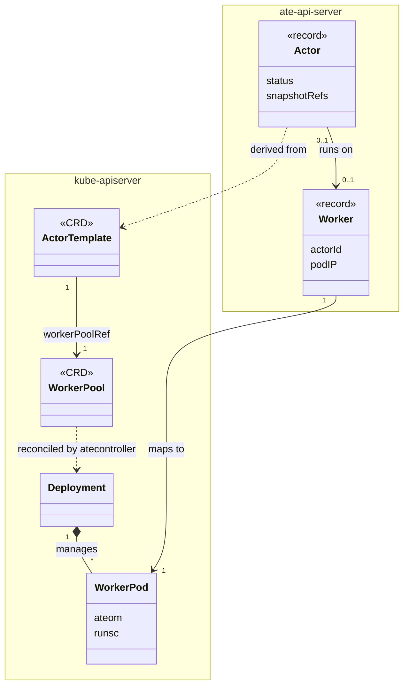
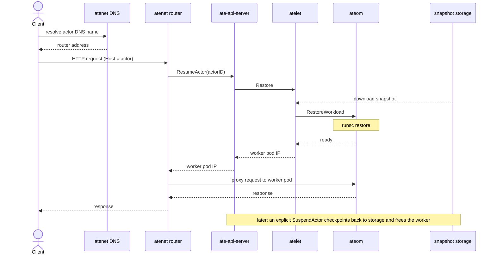
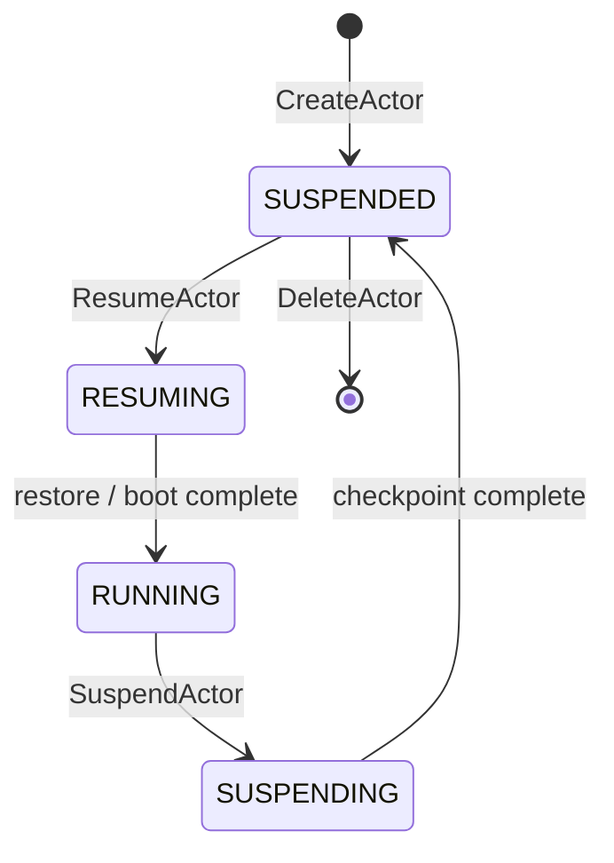

# Agent Substrate 架构

注意：本架构文档中的很多内容是设想性的，尚未实现！

## 概述

Agent Substrate 是一个构建在 Kubernetes 之上的系统，用于管理类 agent（agent-like）
的工作负载，以实现高工作负载密度和大规模扩展。它构建在 Kubernetes 之上，但将
Kubernetes 控制平面（control-plane）移出关键路径，从而实现更低的延迟。Kubernetes
提供基础设施的供给与管理，而 Agent Substrate 提供针对 agent 的调度与控制。

## 问题陈述

Kubernetes 是运行现代工作负载的行业标准平台。它被设计为支持种类繁多的工作负载，
并且能够扩展到非常大的集群规模。Kubernetes 的设计目标是处理数万到数十万个相对
长时间运行的工作负载，但要在大规模场景下运行 agent 则带来了新的挑战。

Agent 及"类 agent"工作负载通常非常具有突发性（bursty）：它们大部分时间都在等待
输入或事件，然后处理这些事件，之后再回到等待状态。它们真正执行工作的时间往往
非常短，而等待的时间可能是无限的。由于它们经常运行不受信任的逻辑，因此通常会
在沙箱（sandbox）中运行，这意味着它们通常是单租户实例，而且数量非常庞大。

在 Kubernetes 上运行这些工作负载会带来若干挑战：
  * 空闲的 Pod 仍然消耗资源。虽然 Kubernetes 非常具有可扩展性，但计算容量是有限的，
    并且有着实际的成本。无论是 CPU 时间、内存空间，还是每个节点上的 Pod 数量，
    类 agent 工作负载在效率方面都表现糟糕。
  * Kubernetes API server 并非设计用来处理数百万个资源。它擅长在众多控制器
    (controller) 之间异步地协调（reconcile）资源，但它并不擅长存储极大数量的
    离散资源，也不擅长处理巨量的写入流量。
  * 在 Kubernetes 上调度一个工作负载需要多个异步过程收敛，加上多个网络跳转
    (network hop)，再加上镜像拉取和其他步骤，这些累加起来会相当可观。当一个 Pod
    要运行数小时或数天时，几秒钟内让它运行起来是很好的；但对于一个只会运行毫秒到
    个位数秒的工作负载而言，这种延迟是无法接受的。
  * 状态管理很困难。Kubernetes 提供了用于管理状态的 API（PersistentVolumes），
    但它并非为数百万个卷（volume）而设计——这些卷的数据量差异巨大，并且需要以
    高速进行挂载和卸载。

## 核心概念与方法

标准的 Kubernetes Pod 对于许多 agent 类工作负载来说实在太重了。

### 术语："Actor"

Agent Substrate 旨在为"类 agent"工作负载解决这些问题。我们通常简单地称之为
"agents"，但需要澄清的是，"类 agent"工作负载不一定真的是 AI agent。在大多数
文档中，我们改用术语"actor"来指代一个类 agent 工作负载的实例。

### 将 Actor 生命周期与 Pod 解耦

解决大量空闲 Pod 消耗资源问题的显而易见的办法，就是不要有空闲的 Pod——当它们
空闲时把它们清除掉，在需要时再把它们带回来。挂起（suspend）与恢复（resume）
在 Kubernetes 中（目前）还不是一个概念，但即使有，实现它的显而易见的方式仍然会
经过 Kubernetes API server 和调度子系统，而这（目前）对于我们的需求来说太慢了。

由于许多 agent 运行不受信任的代码，我们需要以某种方式在沙箱中运行它们。目前有
若干沙箱技术可供选择，其中较为流行的选项包括 [gVisor](http://gvisor.dev) 和诸如
[Kata Containers](https://katacontainers.io/) 这样的 micro-VM。这两者都恰好支持
某种形式的挂起和恢复。

Agent Substrate 从挂起和恢复入手。当一个 actor 空闲时，我们将其挂起，从而释放它
所占用的资源。当有需要处理的事件到来时，我们再恢复该 actor。为了避免经过
Kubernetes 调度器所带来的延迟，我们预先启动长时间运行的"worker" Pod，它们只是
等待工作的沙箱。当事件到来时，我们将其分配给一个 worker，由该 worker 在其内部
恢复对应的 actor。这样我们就可以将较大数量的 actor 多路复用（multiplex）到较少
数量的 worker 上，从而实现更高的密度和效率，同时也降低延迟。

### 一个聚焦的控制平面

这并没有解决 Kubernetes API server 无法处理数百万资源的问题。不幸的是，这个问题
没有魔法般的解决方案。Agent Substrate 不再将每个 actor（无论是活动的还是空闲的）
都存储为一个 Kubernetes 对象，而是包含一个小巧、聚焦的控制平面组件，它专注于高
扩展性和高 QPS。它不需要 Kubernetes API 的通用性，这应当使它在此用例中更为高效。

### 感知 Agent 的路由

为了实现按需恢复 actor，我们需要能够捕获并检查网络流量。Agent Substrate 包含一个
轻量级、感知 substrate 的网络代理，它可以检查传入的流量，并在需要时触发 actor
的恢复。

### 新的问题

当然，天下没有免费的午餐，这些方法也都有其权衡取舍。

首先，我们用一个问题（大量空闲 Pod 消耗资源）换来了另一个问题。在这种规模下进行
挂起和恢复引入了巨大的数据管理问题。我们需要存储数百万个 actor 的状态，而这些状态
每秒可能更新多次。Agent Substrate 需要将数据局部性（data locality）作为一等
(first-class) 关注点来考虑。当事件到来时，我们需要知道该 actor 最新状态存储在
何处，并将事件路由到那个位置，或者将状态移动到能够服务该事件的位置。

除此之外，我们必须承认，构建一个全新的生产级控制平面组件是一项非同小可的工作。
它需要具备高可用性、安全性和高性能，并且需要与 Kubernetes 良好集成。

另一个需要考虑的问题是可观测性（observability）和调试。由于 actor 一直在被多路
复用到 worker 上又从中移出，理解正在发生什么将变得更加困难。Agent Substrate 将
需要为监控和调试 actor 提供强大的工具，包括能够将某个 actor 随时间产生的指标和
日志串联起来的能力、检查被挂起 actor 状态的能力，以及追踪导致其当前状态的事件的
能力。

### 我们尚未解决的问题

尽管这个项目还很早期，但有几个问题我们甚至还没有开始着手，然而我们知道这些问题
最终都需要被解决。

  * 自动扩缩容（Autoscaling）：我们将需要能够根据需求自动地扩容和缩容 worker 的
    数量。Kubernetes 的 Pod 自动扩缩容可能够用，也可能不够用。
  * 点对点状态共享（Peer to peer state sharing）：依赖数据局部性带来了数据丢失的
    风险。我们可能需要某种形式的状态共享来防范这一风险，并且需要在此与将状态保存
    到"永久"存储之间取得平衡。
  * 控制平面认证/授权（Control plane authn/z）：我们需要确保控制平面是安全的，
    并且只有获得授权的用户和 agent 才能与之交互。
  * 身份与策略（Identity and policy）：我们知道，agent 对身份的需求与传统的工作
    负载身份和终端用户凭证有着非常大的不同。
  * 肯定还有更多我们尚未想到的问题！

## 北极星指标（North Star Metrics）

Agent Substrate 是一项雄心勃勃的工作。为了让我们始终聚焦于正确的问题，我们确定了
几个北极星指标及其目标。

  * 激活延迟（Activation Latency）：从接收到唤醒事件到 agent 能够接收流量所经过的
    时间。
    - 目标：95 分位下 100ms
  * 规模（Scale）：单个集群中能够支持的 agent 总数（包括活动的和空闲的）。
    - 目标：10 亿
  * 吞吐量（Throughput）：单个集群中每秒能够处理的唤醒事件数量。
    - 目标：1000 个/秒

## 角色（Personas）

有几种不同的角色会与系统交互：

  1) **集群管理员（Cluster admins）**：他们是 Kubernetes 集群的拥有者，负责其整体
     的健康与性能。如果 Agent Substrate 需要更多容量，就是这些人来管理诸如集群
     自动扩缩容、节点供给等事务。他们大概不需要直接与 Agent Substrate 有太多交互，
     甚至可能从不交互。

  2) **Substrate 管理员（Substrate admins）**：他们是在 Kubernetes 集群中设置并
     拥有 Agent Substrate 实例的人。他们显然知道它运行在 Kubernetes 集群中，并负责
     为其配置相关的 Kubernetes 资源（例如 WarmPools）。

  3) **Agent 开发者（Agent developers）**：他们是将 agent 部署到 substrate 中、
     供用户或更高层系统使用的人。他们可能需要意识到自己正在使用 Kubernetes（一些
     概念以 CRD 的形式表示，例如 ActorTemplates），也可能使用一个更高层的 API，
     而该 API 本身在底层使用了 Agent Substrate。

  4) **Agent 用户（Agent users）**：他们是与运行在 substrate 中的 agent 交互的人。
     他们可能是构建在 Agent Substrate 之上的应用的终端用户，也可能是将 Agent
     Substrate 作为构建块使用的更高层系统。他们完全不需要意识到自己正在使用
     Kubernetes。

## 高层设计

一位 substrate 管理员将 Agent Substrate 部署到一个 Kubernetes 集群中。他们配置将
用于执行 actor 的 WorkerPool，并为使用做好 substrate 控制平面的准备。Worker Pod
被启动，等待分配任务。

一位 agent 开发者定义一个 ActorTemplate（一个 CR），它描述了实例化该 actor 意味
着什么——运行哪个 OCI 镜像、需要多少内存、行为参数等等。Agent Substrate 使用该
ActorTemplate 创建该 actor 的"黄金快照"（golden snapshot），未来将用它来快速启动
该 actor 的实例。

一位 agent 用户（或更高层系统）发出实例化某个 actor 的请求。他们指定要使用哪个
ActorTemplate 以及其他参数。Agent Substrate 在其控制平面存储中创建一条 Actor
记录，用于跟踪该 actor 的状态（挂起或运行中）。

当针对该 actor 实例的请求到来时，Agent Substrate 的代理会拦截该请求。它在控制平面
中查找以确定该 actor 当前是否正在运行。如果没有运行，它会将该 actor 分配给一个
worker，这涉及告知一个节点级组件（即"atelet"）将该 actor 最新的快照恢复到该节点上
的 worker 中。随后，请求会被转发给该 actor。

最终，用户（或更高层系统）用完了该 actor，或者它已空闲一段时间。可以请求 Agent
Substrate 挂起该 actor，拍下一个快照并释放该 worker。下次有针对该 actor 的请求到来
时，它会被再次恢复，可能是在另一个不同的 worker 上。

## API 资源模型

Agent Substrate 根据资源的持久化需求和状态转换频率，将资源分为两组。

### 系统配置（声明式/基于 CRD）

这些资源定义系统的期望状态，并通过 Kubernetes CRD API 进行管理。它们用于管理性
操作和 actor 环境定义。

  * **WorkerPool**：定义一个"热"（warm）计算容量池。它管理一支已初始化并准备好
    接收被恢复 actor 状态的待命 worker pod 队伍。可选的 `spec.template` 字段用于
    配置 worker pod 的节点选择（node selection）、容忍度（tolerations）、优先级类
    (priority class) 和节点亲和性（node affinity）。

  * **ActorTemplate**：一个 actor 版本的不可变定义。它封装了生成"黄金"快照所需的
    容器镜像、配置和环境。

### 动态实例状态（基于数据库）

这些资源表示单个 actor 和 worker 的高频、临时（ephemeral）状态。它们存储在一个
高性能、低延迟的状态存储（目前是 ValKey/Redis）中，以支持实时操作。

  * **Actor**：某个 ActorTemplate 的一个具体实例。一条 Actor 记录跟踪其全局唯一
    标识符、物理位置（Worker IP）、当前状态（RUNNING 或 SUSPENDED）以及与版本
    相关的状态元数据。

  * **Worker**：WorkerPool 中一个 worker pod 的表示。它跟踪该 worker 的唯一标识符、
    当前状态（IDLE 或 BUSY）以及它当前所承载的 Actor（如果有的话）。

### 架构原理

Agent Substrate 利用这种双层模型，以同时优化可靠性（Reliability）和性能
(Performance)：

  1.  **可扩展性（Scalability）**：将数百万个 actor 的高频、大规模管理卸载到一个
      专用的状态存储中，可防止主集群控制平面被每秒数千次的更新压垮。

  2.  **延迟（Latency）**：实现 100ms 的恢复需要低延迟的状态查找和原子性的 worker
      分配，从而绕过标准 Kubernetes API server 的最终一致性（eventual consistency）
      和可变延迟。

  3.  **治理（Governance）**：为环境（WorkerPool 和 Template）使用 Kubernetes 对象，
      使平台团队能够将他们熟悉的 RBAC、审计和策略执行应用到底层基础设施上。

### 资源模型

上文所述的 CRD 和控制平面记录，及其关系与多重性（UML 类图）：

## 系统组件

### 控制平面（`ate-api-server`）

系统的大脑。它暴露一个 gRPC API 供数据平面和 CLI 用来管理 actor 的生命周期。

  * **状态存储（State Store）**：在一个高性能的 Redis 存储中跟踪 Actor 到 Worker
    的映射。

  * **调度器（Scheduler）**：为恢复请求选择一个就绪的 worker。

  * **工作流引擎（Workflow Engine）**：编排多步骤的恢复/挂起（Resume/Suspend）
    序列（获取锁、下载存储、恢复沙箱）。

### 节点监督者（`atelet` + `ateom`）

节点级子系统管理沙箱的物理执行以及快照的移动。

  * **atelet**：作为 DaemonSet 运行在每个节点上的轻量级监督者。它扮演"牧人"
    (Herder) 的角色，管理一个物理 pod 池，并与控制平面通信。

  * **ateom**：一个专用的沙箱牧人（sandbox-herder）容器镜像——每个沙箱类
    (sandbox class) 一个（`ateom-gvisor`、`ateom-microvm`）——运行在物理 worker
    pod 内部。它提供一个 gRPC 接口，供 `atelet` 触发 `RunWorkload`、
    `CheckpointWorkload` 和 `RestoreWorkload` 操作。这种分离确保物理 pod 的生命周期
    与沙箱化的 agent 进程保持解耦。

  * **生命周期管理（Lifecycle Management）**：`ateom` 进程调用沙箱运行时来在物理
    pod 边界内对进程进行检查点（checkpoint）或恢复（restore）——对于 gVisor 使用
    `runsc`，对于 micro-VM 使用 Kata + Cloud Hypervisor 技术栈。（注意：gVisor
    后端目前需要带有 `--allow-connected-on-save` 标志的 `runsc` 版本，以绕过
    检查点过程中网络恢复的一个 bug。）

  * **存储搬运器（Storage Mover）**：`atelet` 将快照流式传输到 GCS/S3 或从中读取，
    确保进程状态在整个集群中是持久且可移植的。

### 沙箱类（Sandbox Classes）

一个 `WorkerPool` 选择一个**沙箱类**（`spec.sandboxClass`），每个类都有一个匹配的
`ateom` 牧人镜像。沙箱二进制文件本身并不被烘焙进 worker 镜像中——它们在运行时从
一个集群级（cluster-scoped）的 [`SandboxConfig`](api-guide_cn.md#3-sandboxconfig-sandbox-binaries)
获取，并被固定（pin）到每个快照的清单（manifest）中，从而使恢复操作在运行时升级
之间保持可复现。

  * **gVisor**（`ateom-gvisor`，默认值）：在 `runsc` 下运行工作负载，以实现内核级
    沙箱化。挂起和恢复利用 gVisor 对沙箱化进程树的原生检查点/恢复能力。

  * **micro-VM**（`ateom-microvm`）：在 [Cloud Hypervisor](https://www.cloudhypervisor.org/)
    VMM 上的 [Kata Containers](https://katacontainers.io/) 客户机（guest）内部运行
    工作负载。挂起和恢复会捕获一个仅内存（memory-only）的 VM 快照，并使用
    `userfaultfd` 内存按需分页（demand-paging）按需将其恢复，同时通过 `tmpfs`
    覆盖层（overlay）将容器 rootfs 的写入捕获到客户机 RAM 中。

### 网络栈（`atenet` + Envoy）

处理会话感知（session-aware）的路由和自动重新唤醒（re-animation）。

  * **统一 DNS 网格（Uniform DNS Mesh）**：Substrate 通过一个全局 DNS 后缀
    (`<id>.actors.resources.substrate.ate.dev`) 提供位置透明（location-transparent）
    的 actor 发现方案。

  * **路由（Routing）**：`atenet` 路由器（由 Envoy 和一个 External Processing
    服务器驱动）拦截去往该网格的流量。它从 `Host` 头中提取 actor ID，查询控制平面
    以确定该 actor 的当前位置，并在会话当前处于挂起状态时触发一个 `ResumeActor`
    工作流。

  * **延迟（Latency）**：数据平面通过绕过 Kubernetes 的最终一致性并执行原子性的
    物理分配，被优化为可实现低于 100ms 的激活。

## Actor 生命周期

一个 actor 的生命周期遵循一个由状态驱动的序列。请求通过网络栈到达 actor，如果该
actor 处于挂起状态，网络栈会将其恢复到某个 worker 上（UML 序列图）：

一个 Actor 的 `status` 会经历以下状态（UML 状态机图）：

### 阶段 1：创建（`CreateActor`）

用户或框架调用 `CreateActor`，传入一个唯一 ID 和一个指向 `ActorTemplate` 的引用。

  * **状态（Status）**：该 actor 以状态 `STATUS_SUSPENDED` 被注册到数据库中。

  * **状态（State）**：该记录在数据库中被初始化，包含从关联的 ActorTemplate 派生
    出来的元数据和**黄金快照**（Golden Snapshot，版本 0）引用。这确保了该 actor
    在其首次请求到来时可以被立即注入（hydrated）到一个热 worker 中。

### 阶段 2：激活（`ResumeActor`）

由 Gateway 处的一个入站请求或一次显式的 API 调用触发。

  1. **触发（Trigger）**：Gateway 暂停请求，并向控制平面询问该 actor 的位置。

  2. **分配（Assignment）**：控制平面从 `WorkerPool` 中认领一个热 worker。

  3. **注入（Hydration）**：`atelet` 监督者与 worker pod 内部的 `ateom` 进程协作，
     将 `GoldenSnapshot`（用于首次运行）或 `LatestSnapshotInfo`（用于后续运行）
     恢复到沙箱中。

  4. **状态（Status）**：状态转换为 `STATUS_RUNNING`。该 actor 现在拥有一个活动的
     Worker IP。

  5. **响应（Response）**：控制平面将 worker IP 返回给 Gateway，由 Gateway 转发
     原始请求。

### 阶段 3：休眠（`SuspendActor`）

由一次显式的 `SuspendActor` 调用触发。

  1. **检查点（Checkpoint）**：`atelet` 指示 `ateom` 冻结进程并捕获一个内存+磁盘
     快照。

  2. **持久化（Persistence）**：`atelet` 将快照从 pod 流式传输到持久存储
     (例如 GCS)。

  3. **回收（Reclaim）**：物理 worker 被擦除并归还给 `WorkerPool`。

  4. **状态（Status）**：状态转换回 `STATUS_SUSPENDED`，现在指向用于未来恢复的
     `LatestSnapshotInfo`。

### 阶段 4：删除

处于 `STATUS_SUSPENDED` 状态的 actor 可以从控制平面中删除。删除后，该 actor 的
状态（即内存+磁盘快照）会被垃圾回收。垃圾回收过程尚未实现。

## 状态管理与持久化

Agent Substrate 区分两种类型的状态，目前它们被一起捕获在一个带版本的快照中：

  1.  **内存快照（Memory Snapshot）**：进程精确的 RAM 状态。

  2.  **工作卷（磁盘）（Working Volume (Disk)）**：写入容器可写层的文件
      （即"工作内存"）。

在当前实现中，内存状态和磁盘状态都与特定版本的代码（ActorTemplate）绑定。这确保了
恢复期间的严格一致性。

快照被持久存储在 **Google Cloud Storage (GCS)** 中。这种模型使得 `WorkerPool` 中的
物理计算资源能够在 actor 空闲时被完全回收，而不会丢失任何进程或文件系统的进展。

## 安全与隔离

Agent Substrate 建立在**纵深防御**（Defense-in-Depth）模型之上：

  * **沙箱化执行（Sandboxed Execution）**：每个 actor 都运行在一个加固的内核空间
    隔离层（例如 gVisor）内部，从而防止容器逃逸（container escape）。

  * **Actor 身份（Actor Identity）**：每一次交互都由一个独立于底层硬件、由 Agent
    Substrate 管理的唯一身份来驱动。这确保了即使 actor 在物理节点或代码版本之间
    迁移，它们也能维持自己细粒度的权限和安全上下文。

  * **请求授权（Request Authorization）**：系统当前通过在 gateway 处使用统一的 DNS
    路由方案（`<actor id>.actors.resources.substrate.ate.dev`）来执行**身份感知
    路由**（Identity-Aware Routing），从传入流量中提取并验证 actor 标识符。这确保
    请求只会被路由到已识别、已注册的 actor。可插拔的、细粒度的授权策略计划在未来的
    里程碑中实现。

  * **网络策略（Network Policy）**：Agent Substrate 利用标准的 Kubernetes
    NetworkPolicy 进行连接控制。策略可以应用在 `WorkerPool` 边界处，以限制该池内
    所承载的所有 actor 的入站/出站（ingress/egress）流量。

  * **处处 mTLS（mTLS Everywhere）**：所有内部系统通信（例如控制平面到 Atelet）
    都通过带有短生命周期证书的双向 TLS（mutual TLS）来保护。
