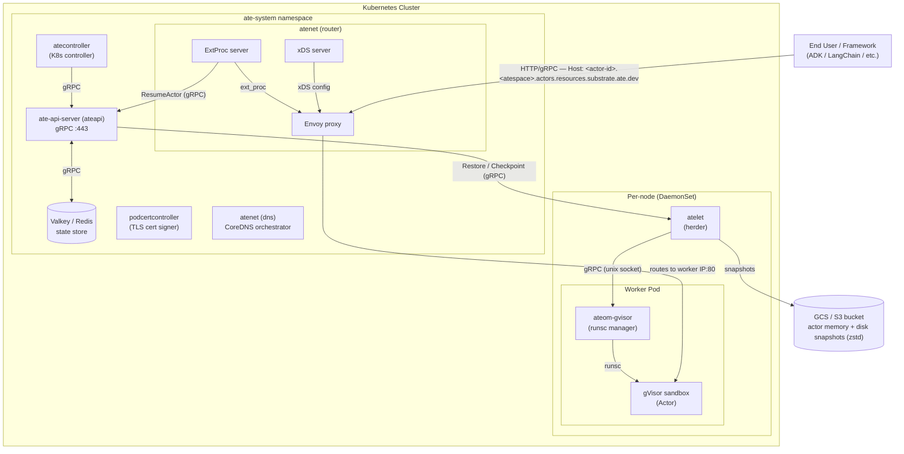
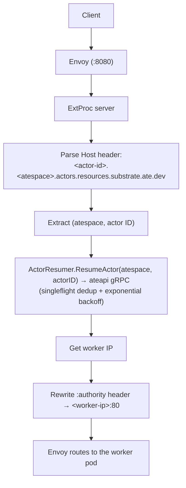
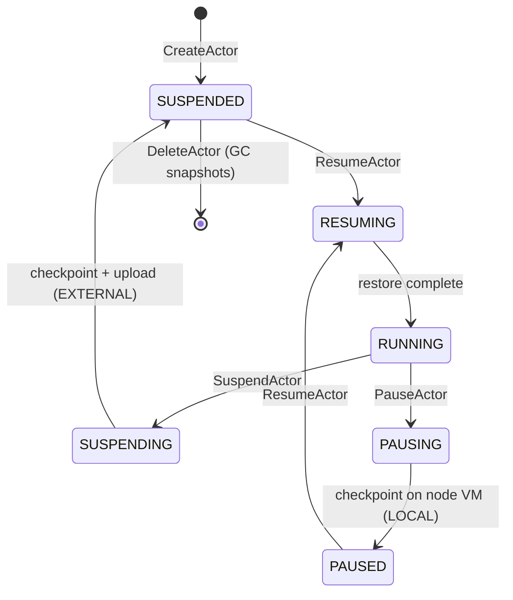
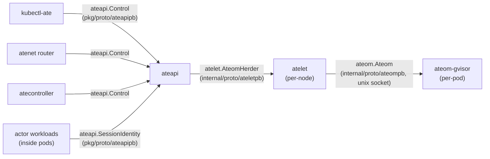
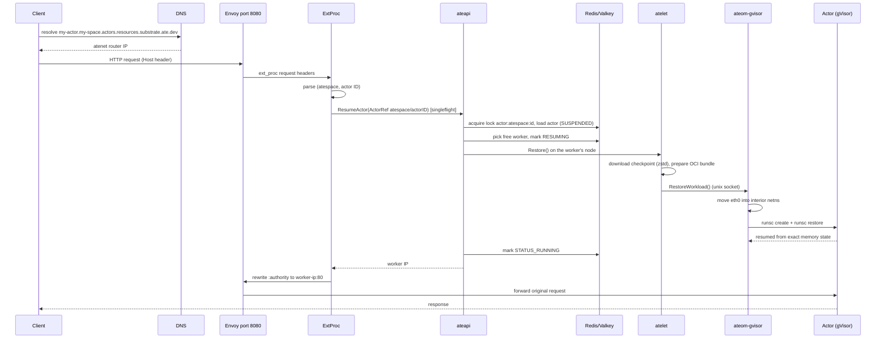
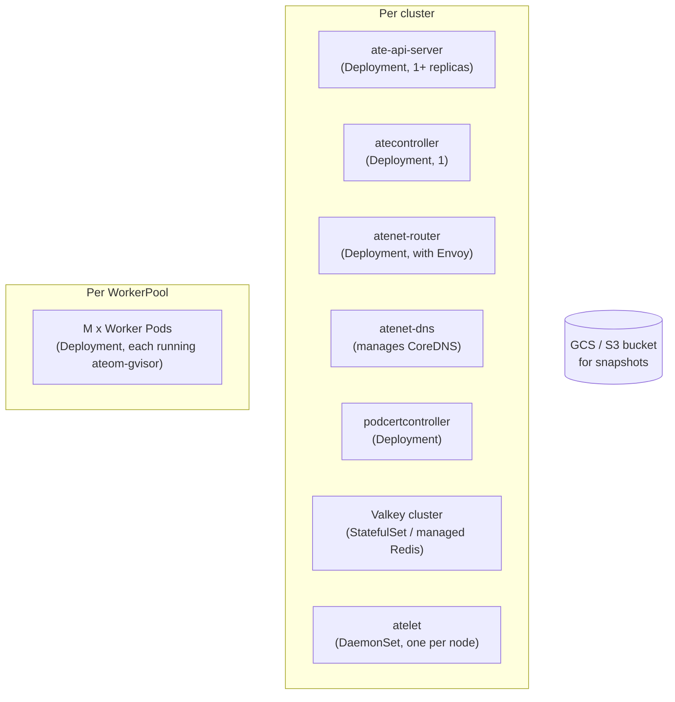

# Agent Substrate — Architecture Deep Dive

> Generated from source-code analysis of the repository at commit HEAD.  
> Date: 2026-07-07

---

## 1. Executive Summary

**Agent Substrate** is a Google-originated open-source system that runs on top of Kubernetes to manage "agent-like" (stateful, bursty, idle-heavy) workloads at massive scale. It achieves **30x+ oversubscription** by mapping a large number of logical **Actors** (e.g., AI agents, coding sessions) onto a small pool of physical **Workers** (K8s Pods). It does this via gVisor process checkpoint/restore — suspending idle actors to cloud object storage and resuming them in sub-second latency when traffic arrives.

**North Star Targets:**
| Metric | Target |
|--------|--------|
| Activation latency | 100ms @ p95 |
| Total actors (active + idle) per cluster | 1 billion |
| Wakeup throughput | 1,000/sec |

**Codebase:** ~29,500 lines of Go (excluding vendor), 183 source files, 7 binaries, 3 protobuf service definitions, 3 CRDs (`WorkerPool`, `ActorTemplate`, `SandboxConfig`).

---

## 2. High-Level Architecture Diagram



---

## 3. Component Breakdown

### 3.1 Control Plane: `ateapi` (ate-api-server)

| Aspect | Detail |
|--------|--------|
| Binary | `cmd/ateapi` |
| Runs as | Deployment in `ate-system` |
| API | gRPC over mTLS (:443) — `ateapi.Control` + `ateapi.SessionIdentity` |
| State Store | Redis/Valkey cluster (TLS + IAM auth) |

**Responsibilities:**
- Actor lifecycle management (Create, Resume, Suspend, Pause, Delete, Update, Get, List)
- Atespace management (Create, Get, List, Delete) — the isolation boundary actors live in
- Worker registry and selector-based assignment scheduling
- Workflow orchestration with distributed locking
- Session identity credential issuance (JWT, mTLS certs)

**Key internals:**
- **`controlapi.Service`** — implements the `Control` gRPC service
- **`ActorWorkflow`** — orchestrates multi-step Resume/Suspend sequences
- **`WorkerPoolSyncer`** — watches K8s Pod informers and syncs worker state into Redis
- **`store.Interface`** / `ateredis.Persistence` — Redis-backed persistence with optimistic concurrency (version fields)
- **Distributed lock** — per-actor Redis locks (30s TTL) prevent concurrent resume/suspend races

**Resume Workflow Steps:**
1. `LoadActorForResume` — fetch actor + template from DB/K8s
2. `AssignWorker` — pick a free worker from the pool (random shuffle), mark it as busy
3. `CallAteletRestore` — RPC to the atelet on that node to restore the snapshot
4. `FinalizeRunning` — mark actor as `STATUS_RUNNING`

**Suspend Workflow Steps:**
1. `LoadActorForSuspend` — fetch current state
2. `MarkSuspending` — transition to `STATUS_SUSPENDING`, generate snapshot URI
3. `CallAteletSuspend` — RPC to checkpoint the workload + upload to GCS
4. `FinalizeSuspended` — free the worker, mark actor `STATUS_SUSPENDED`

---

### 3.2 Kubernetes Controller: `atecontroller`

| Aspect | Detail |
|--------|--------|
| Binary | `cmd/atecontroller` |
| Runs as | Deployment (controller-runtime manager) |
| Watches | `WorkerPool`, `ActorTemplate` CRDs |

**WorkerPool Reconciler:**
- Creates/manages a K8s `Deployment` for each `WorkerPool`
- Each replica runs the `ateom-gvisor` container image with `privileged: true`
- Syncs `status.replicas` from the Deployment

**ActorTemplate Reconciler (Golden Snapshot creation):**
1. `PhaseInitial` → calls `CreateActor` (golden actor) via ateapi
2. `PhaseResumeGoldenActor` → calls `ResumeActor` (boots from OCI image fresh)
3. `PhaseWaitGoldenActor` → waits 20s for initialization, then calls `SuspendActor`
4. `PhaseReady` → stores `goldenSnapshot` URI in status; template is ready

---

### 3.3 Node Supervisor: `atelet` (DaemonSet)

| Aspect | Detail |
|--------|--------|
| Binary | `cmd/atelet` |
| Runs as | DaemonSet on every node, `privileged: true` |
| API | gRPC `atelet.AteomHerder` on :8085 (called by ateapi) |

**Responsibilities:**
- **OCI image pulling** — uses `go-containerregistry` with GCP auth; in-memory layer cache
- **OCI bundle preparation** — assembles rootfs + config.json per OCI spec
- **runsc binary management** — downloads correct gVisor version by SHA256 hash
- **Snapshot transfer** — downloads from GCS/S3 (zstd-compressed), uploads after checkpoint
- **Delegates to ateom** — communicates with per-pod `ateom-gvisor` process via Unix socket

**RPC interface:**
- `Run(RunRequest)` — fresh boot an actor from OCI images
- `Checkpoint(CheckpointRequest)` — save state + upload to object storage
- `Restore(RestoreRequest)` — download snapshot + restore from checkpoint

**Storage backends:** GCS (default), S3 (via `ATE_STORAGE_BACKEND=s3`)

---

### 3.4 In-Pod Sandbox Manager: `ateom-gvisor`

| Aspect | Detail |
|--------|--------|
| Binary | `cmd/ateom-gvisor` (Linux only) |
| Runs as | Container inside each Worker Pod |
| API | gRPC `ateom.Ateom` over Unix socket (`/run/ateom-gvisor/<pod-uid>/ateom.sock`) |

**Responsibilities:**
- Manages the **interior network namespace** — moves `eth0` into a netns for gVisor
- Executes `runsc create`, `runsc start`, `runsc checkpoint`, `runsc restore`, `runsc delete`
- Child process reaping (acts as PID 1 for orphaned sandbox processes)
- Actor lifecycle logging (structured JSON with actor metadata)

**Key design:**
- Holds a mutex — only one actor operation at a time per pod
- On `RunWorkload`/`RestoreWorkload`: moves `eth0` into interior netns, starts pause + app containers
- On `CheckpointWorkload`: checkpoints pause container, deletes all containers, moves `eth0` back
- Uses `-allow-connected-on-save` flag for gVisor networking compatibility

---

### 3.5 Networking: `atenet`

| Aspect | Detail |
|--------|--------|
| Binary | `cmd/atenet` (cobra multi-command) |
| Sub-commands | `router`, `dns` |

#### 3.5.1 Router (Envoy + ExtProc)

The router is the **traffic entry point** for all actor-destined requests.

**Components running inside the router pod:**
1. **Envoy proxy** (data plane) — receives HTTP traffic on :8080/:8443
2. **xDS Server** — configures Envoy dynamically with listeners, clusters, routes
3. **ExtProc Server** (gRPC :50051) — Envoy's External Processing filter calls this for every request

**Request flow:**


**Key features:**
- **Singleflight** — deduplicates concurrent resume requests for the same actor
- **Detached context** — resume operation continues even if first caller disconnects
- **Status endpoint** — `/statusz` for operational visibility

#### 3.5.2 DNS Controller

- Orchestrates CoreDNS configuration to resolve `*.actors.resources.substrate.ate.dev` to the router
- Reconciles periodically, writes Corefile updates

---

### 3.6 CLI: `kubectl-ate`

| Aspect | Detail |
|--------|--------|
| Binary | `cmd/kubectl-ate` |
| Functions | create/get/delete actors, suspend/resume, logs, admin utilities |

Notable capabilities:
- `kubectl ate create atespace <name>` / `get atespaces` / `delete atespace <name>` — manage isolation boundaries (an atespace must exist before creating actors in it)
- `kubectl ate create actor <id> --template <ns>/<name> -a <atespace>` — create an actor (`-a/--atespace` required)
- `kubectl ate suspend|resume|pause|delete actor <id> -a <atespace>` — lifecycle control
- `kubectl ate get actors -a <atespace>` (one atespace) or `-A` (all atespaces); `get workers` — query state
- `kubectl ate logs actors <actor-id> -a <atespace> [-f]` — follows logs even across pod migrations
- `kubectl ate admin debug-flush-redis` — wipe Redis for testing
- `--trace` flag for OpenTelemetry trace propagation

---

### 3.7 Pod Certificate Controller: `podcertcontroller`

- Signs short-lived TLS certificates for pods
- Polyfill for upstream K8s Pod Certificate feature (not yet available)
- Enables mTLS between system components

---

## 4. Data Model

### 4.1 Kubernetes CRDs (Declarative Configuration)

```yaml
# WorkerPool — defines physical compute capacity
apiVersion: ate.dev/v1alpha1
kind: WorkerPool
metadata:
  labels: {workload: agent} # pools are selected by ActorTemplate.workerSelector
spec:
  replicas: 10              # Number of warm worker pods
  ateomImage: <image>       # ateom-gvisor container image
  sandboxClass: gvisor      # gvisor (default) or microvm

# ActorTemplate — immutable workload blueprint (spec is immutable)
apiVersion: ate.dev/v1alpha1
kind: ActorTemplate
spec:
  pauseImage: <pinned>      # Root sandbox container
  containers:               # App containers (image must be pinned @sha256)
  - name: agent
    image: <image@sha256:...>
    command: ["/app/server"]
    readyz: {httpGet: {path: /readyz, port: 80}}
    volumeMounts: [{name: data, mountPath: /home/agent}]
  sandboxClass: gvisor      # gvisor (default) or microvm; must match eligible pools
  workerSelector:           # label selector over WorkerPools (replaces workerPoolRef)
    matchLabels: {workload: agent}
  snapshotsConfig:
    location: gs://bucket/path/
    onPause: Full           # Full = memory + rootfs delta; Data = durable volumes only
    onCommit: Data          # must be a subset of onPause
  volumes:                  # optional durable volumes
  - name: data
    durableDir: {}
status:
  phase: Ready
  goldenActorID: <uuid>
  goldenSnapshot: gs://...  # Version 0 snapshot
```

> The gVisor `runsc` binary (and micro-VM assets) are no longer declared on the
> `ActorTemplate`. They live on a **cluster-scoped `SandboxConfig`** selected by
> `sandboxClass`; the base install ships a default gVisor `SandboxConfig`.

### 4.2 Redis State (Dynamic Runtime State)

```
actor:<atespace>:<actor-id>  →  Actor proto (JSON)
  - actor_id, atespace, version (optimistic concurrency)
  - actor_template_namespace, actor_template_name
  - status: SUSPENDED | RESUMING | RUNNING | SUSPENDING | PAUSING | PAUSED
  - ateom_pod_namespace, ateom_pod_name, ateom_pod_ip, ateom_pod_uid
  - worker_pool_name, worker_selector
  - latest_snapshot_info (local or external), in_progress_snapshot

worker:<ns>:<pool>:<pod>  →  Worker proto (JSON)
  - worker_namespace, worker_pool, worker_pod, worker_pod_uid
  - ip, node_name, version
  - assignment: {actor_template, actor:{atespace, name}} (empty = idle)

atespace:<name>  →  Atespace proto (JSON)

lock:actor:<atespace>:<actor-id>  →  UUID (TTL-based distributed lock)
```

### 4.3 Object Storage (Snapshots)

```
gs://bucket/snapshots/<template>/<actor-id>/<timestamp>-<random>/
  ├── checkpoint.img.zstd    # Memory + sentry state (always present)
  ├── pages.img.zstd         # Optional: memory pages
  └── pages_meta.img.zstd    # Optional: pages metadata
```

---

## 5. Actor State Machine



> In addition to suspend/resume, an actor can be **paused**
> (`RUNNING → PAUSING → PAUSED`). Pause keeps the snapshot **local on the node
> VM** (`SnapshotInfo` of type `LOCAL`) instead of uploading it to object
> storage, trading portability for a faster same-node resume. Suspend produces
> an `EXTERNAL` snapshot in object storage. Both `PAUSED` and `SUSPENDED` actors
> resume on the next request.

---

## 6. Communication Topology (gRPC Services)



---

## 7. Request Lifecycle (End-to-End)

Here's what happens when an HTTP request arrives for a **suspended** actor:



---

## 8. Security Architecture

| Layer | Mechanism |
|-------|-----------|
| Actor isolation | gVisor (runsc) kernel-level sandbox |
| System inter-component | mTLS with short-lived certificates |
| Redis access | TLS + Google IAM authentication |
| Actor identity | Session JWT (OIDC-compatible) + Session mTLS certs |
| Request routing | DNS-based actor identification + validation |
| Network policy | Standard K8s NetworkPolicy at WorkerPool boundary |
| Node access | atelet/ateom run privileged (required for netns manipulation) |

---

## 9. Technology Stack

| Category | Technology |
|----------|-----------|
| Language | Go 1.26 |
| Container runtime | gVisor (runsc) with checkpoint/restore |
| State store | Redis/Valkey cluster |
| Object storage | GCS (primary), S3 (supported) |
| K8s framework | controller-runtime, client-go, informers |
| Networking proxy | Envoy + ExtProc (go-control-plane) |
| DNS | CoreDNS (orchestrated) |
| Observability | OpenTelemetry (traces + metrics), Prometheus, Jaeger |
| Compression | zstd (klauspost/compress) |
| Container images | ko (build), go-containerregistry (pull) |
| Infrastructure | GKE (primary), KinD (local dev) |

---

## 10. Repository Structure Map

```
substrate/
├── cmd/
│   ├── ateapi/                    # Control plane API server
│   │   └── internal/
│   │       ├── controlapi/        # gRPC service impl + workflows
│   │       ├── sessionidentity/   # JWT/cert issuance
│   │       └── store/             # Persistence interface + Redis impl
│   ├── atecontroller/             # K8s controller (CRD reconcilers)
│   ├── atelet/                    # Node supervisor DaemonSet
│   │   └── internal/ategcs/       # GCS/S3 object storage client
│   ├── atenet/                    # Network router + DNS
│   │   └── internal/app/
│   │       ├── router/            # Envoy xDS + ExtProc + controller
│   │       └── dns/               # CoreDNS orchestrator
│   ├── ateom-gvisor/              # In-pod gVisor manager
│   │   └── internal/ateom/        # Actor logging
│   ├── kubectl-ate/               # CLI plugin
│   │   └── internal/cmd/          # Subcommands
│   └── podcertcontroller/         # Pod certificate signer
│
├── internal/
│   ├── ateinterceptors/           # gRPC middleware (logging, tracing)
│   ├── ateompath/                 # Filesystem path conventions for ateom
│   ├── controllers/               # WorkerPool + ActorTemplate reconcilers
│   ├── credbundle/                # TLS credential bundle loader
│   ├── dns/                       # DNS Corefile generator
│   ├── memorypullcache/           # In-memory OCI layer cache
│   ├── proto/
│   │   ├── ateletpb/             # atelet ↔ ateapi internal proto
│   │   └── ateompb/              # ateom ↔ atelet internal proto
│   ├── rendezvous/               # Rendezvous hashing
│   ├── serverboot/               # Common server init (logging, tracing, metrics)
│   ├── sessionidjwt/             # Session identity JWT signing
│   └── ...                       # localca, k8sjwt, podcertificate, etc.
│
├── pkg/
│   ├── api/v1alpha1/             # CRD types (WorkerPool, ActorTemplate)
│   ├── client/                   # Generated clientset, informers, listers
│   └── proto/ateapipb/           # Public gRPC API proto (Control + SessionIdentity)
│
├── manifests/ate-install/         # K8s deployment YAMLs
├── demos/                         # Counter, Sandbox, Claude Code, Secret Agent
├── hack/                          # Dev scripts, boilerplate, CI
├── tools/setup-gcp/              # GCP provisioning tool
├── benchmarking/                  # Locust load tests
└── monitoring/dashboards/         # Grafana dashboards
```

---

## 11. Key Design Patterns

### 11.1 Client-Driven Forward Recovery
The workflow engine (`RunWorkflow`) uses idempotent steps with `IsComplete()` guards. If a workflow is interrupted mid-flight, the next client retry will fast-forward through completed steps and resume from where it left off.

### 11.2 Dual-Layer State Model
- **K8s CRDs** for slow-changing config (WorkerPool, ActorTemplate) — RBAC, GitOps, audit
- **Redis** for high-frequency state (Actor ↔ Worker mapping) — low latency, optimistic concurrency

### 11.3 Optimistic Concurrency Control
Every Actor and Worker record carries a `version` field. Updates require passing the expected version; Redis rejects mismatches (`ErrPersistenceRetry`), forcing retry with fresh state.

### 11.4 Singleflight Deduplication (Router)
Multiple simultaneous requests for the same suspended actor are collapsed into a single `ResumeActor` call via `sync/singleflight`. Background context ensures the resume survives caller timeouts.

### 11.5 Network Namespace Juggling (ateom)
`eth0` is physically moved between the pod's root netns and an interior netns created for gVisor. This gives the sandboxed process direct network access without veth pairs, while allowing ateom to reclaim the interface after checkpoint.

### 11.6 Golden Snapshot Pattern
Each `ActorTemplate` automatically generates a "golden snapshot" (Version 0) by:
1. Booting a fresh actor from OCI image (the golden actor lives in the reserved `ate-golden` atespace)
2. Waiting 20s for initialization
3. Suspending to create the baseline snapshot

All future actors instantiated from that template restore from this golden snapshot, avoiding cold-boot latency.

---

## 12. Observability

| Signal | Implementation |
|--------|---------------|
| **Logs** | Structured JSON, actor metadata injected automatically; `kubectl ate logs` streams from active pod |
| **Metrics** | OpenTelemetry → Prometheus; `rpc.server.call.duration`, system metrics |
| **Traces** | OpenTelemetry (OTLP export); on-demand via `--trace` flag; Jaeger (local) / Cloud Trace (GKE) |

---

## 13. Deployment Topology



---

## 14. Current Limitations & Future Direction

| Area | Current State | Planned |
|------|--------------|---------|
| Sandbox | gVisor + experimental micro-VM (Kata / cloud-hypervisor), selected per pool/template via `sandboxClass` | Broader micro-VM hardening |
| Storage | GCS + S3 | + tiering (local SSD, zswap, peer-to-peer) |
| Autoscaling | Manual replicas | Worker HPA, vertical scaling |
| Auth | Limited (TLS, IAM) | User authz, actor-to-actor policy |
| Networking | Default allow within pool | Per-actor L7 policy, default deny |
| Scheduling | Random free worker | Data locality-aware scheduling |
| Snapshots | Full memory every time | Incremental snapshots, rootfs-only mode |
| Scale | Single Redis | Horizontal sharding (hash tags) |

---

## 15. Quick Reference: How to Run Locally

```bash
# 1. Create local KinD cluster
hack/create-kind-cluster.sh

# 2. Install system + demo
hack/install-ate-kind.sh --deploy-ate-system
hack/install-ate-kind.sh --deploy-demo-counter

# 3. Build CLI
go install ./cmd/kubectl-ate

# 4. Create an atespace, then an actor in it
kubectl ate create atespace demo
kubectl ate create actor my-counter-1 --template ate-demo-counter/counter -a demo

# 5. Port-forward the router
kubectl port-forward -n ate-system svc/atenet-router 8000:80

# 6. Send traffic (triggers resume)
curl -X POST -H "Host: my-counter-1.demo.actors.resources.substrate.ate.dev" http://localhost:8000/
```
