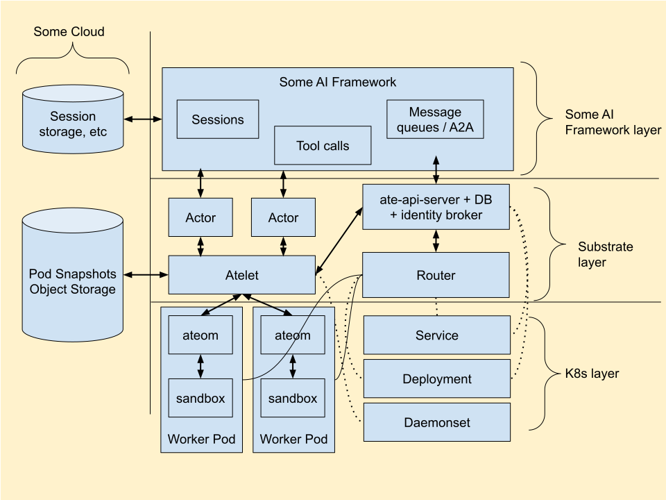

# Substrate 威胁模型

[Michael Taufen](mailto:mtaufen@google.com), [Vikas Kumar](mailto:skvikas@google.com), [Oleg Mitrofanov](mailto:gooleg@google.com)

最后更新：2026 年 6 月 25 日

待办：
- [ ] 为每个威胁提交 GitHub issue  
- [ ] 基于该威胁模型提取审查技能/回归测试

# 概述

Substrate 是一个早期、快速演进的产品。它充满争议且可能变化，包括重大的架构变更。目前它几乎没有安全加固。因此，本威胁模型聚焦于如何针对 Substrate 试图解决的一般性问题——即有状态 AI 智能体的快速编排——来实现安全。本威胁模型以 Substrate 当前的实现和路线图作为参考点，但聚焦于从这类系统整体中涌现出的威胁，而非特定于当前实现的威胁。

# 预期结果

* 经过与社区的审查并达成一致后，本威胁模型的建议应被加入 Substrate 的官方路线图。   
* 应从本威胁模型中提取用于 AI 辅助安全审查的安全审查 SKILL，并用于对上游 [agent-substrate/substrate](https://github.com/agent-substrate/substrate) 仓库进行持续审查。

# 目标

* 识别与任何试图达成相同目标、且大致使用与 Substrate 相同基本构件（Kubernetes、容器、沙箱、快照，以及动态调度到可复用 "worker" Pod 上的轻量级 "actor"）的系统相关的威胁。   
* 识别通用的"缓解不变式"（mitigating invariants），如果实现了这些不变式，就能消除威胁或显著降低其严重性。  
* 建议*可能的*实现方法，这些方法可能会随 Substrate 的变化而改变。  
* 对威胁进行优先级排序，以便优先将资源用于降低最大的风险。

# 非目标

* 本威胁模型不试图预测 Substrate 未来的架构决策。  
* 本威胁模型不要求采用任何特定的缓解方法。  
* 虽然在图示中作为参考展示，但本威胁模型不聚焦于可能构建在 Substrate 之上的 AI 框架。 

# Substrate 架构

# 关键组件

* **ate-api-server：** Actor 创建与调度，以及凭据签发。  
* **atelet：** 每节点守护进程，执行快照/恢复。  
* **ateom：** 每 worker Pod 的 sidecar，运行在 worker Pod 内部。Ateom 在 worker Pod 中设置"内部"沙箱并管理沙箱生命周期，包括镜像拉取。它目前使用 gvisor，但 Substrate 将支持多种 microvm 方案。  
* **Worker：** 预置的 Pod，actor 被调度到其上。  
* **Actor：** 核心计算原语，通过 Run（冷启动）和 Resume（快照恢复）在 worker 之间调度进出。  
* **Actor IP：** Actor 网络基于 Pod 网络。每个 actor 获得其当前被调度到的 worker 的 IP。ateom 在设置内部沙箱时有机会设置额外规则。  
* **Actor DNS：** 每个 Actor 获得一个形如 `<actor-id>.actors.resources.substrate.ate.dev` 的 DNS 名称。Substrate 运行一个自定义的 CoreDNS 实例，对任何匹配 actor DNS 名称模式的 A 记录查询返回 atenet-router 的 IP 地址。Substrate 还包含一个内置控制器，它既让 Substrate 的 CoreDNS 配置与路由器的 Service IP 保持最新，又用一个指向 Substrate CoreDNS Service IP 的存根域（stub domain）`actors.resources.substrate.ate.dev` 更新 kube-dns。后者使传统 Kubernetes Pod 能够解析 Substrate Actor 的 DNS 名称。   
* **atenet-router：** Substrate 运行一个 Envoy 代理来处理对 actor 的入站流量。当客户端向 actor 的 DNS 名称发送请求时，它被解析到 atenet-router 的 Envoy sidecar。随后 Envoy 将请求头转发给 atenet-router（ext\_proc 过滤器），后者提取 actor ID，在 actor 处于挂起状态时自动恢复它，向 Substrate API 查询该 actor 的当前 IP，并在将请求转发给 actor 之前告诉 Envoy 将 host header 重写为 actor IP。atenet-router 包含一个本地 xDS 服务器，用该行为配置 Envoy sidecar。  
* **对象存储：** 用于存储 actor 快照。  
* **文件系统支持：** 容器本地文件系统被保存在快照中，未来的集成可能包括网络存储。  
* **Substrate 数据库：** 目前为 Valkey（兼容 Redis 的 API）。后端数据库/接口的选择仍在积极讨论中。  
* **Kubernetes：** Substrate 运行所依赖的底层基础设施预期是 Kubernetes。

# 威胁与缓解措施

**表格模式：**

* **优先级（Priority）：** 严重（Critical）、高（High）、中（Medium）、低（Low）  
* **威胁（Threats）：** 在 Substrate 的朴素实现中预期的风险。  
* **缓解不变式（Mitigating Invariants）：** 若为真则可缓解威胁的高层属性。  
* **建议的具体缓解措施（Suggested Concrete Mitigations）：** 基于当前对 Substrate 的理解，实现缓解不变式的具体选项。  
* **备注（Notes）：** 其他相关信息。

## 来自外部网络的攻击

虽然 Substrate 预期是位于用户服务后面的内部层，因此不太可能直接暴露于互联网，但如果由于某种原因它被暴露了，以下风险可能适用。

| GitHub Issue | 优先级 | 威胁 | 缓解不变式 | 建议的具体缓解措施 | 备注 |
| :---- | :---- | :---- | :---- | :---- | :---- |
|  | 严重 | 外部攻击者可以通过互联网访问 actor | 默认阻止通过外部互联网访问 actor。 | 在文档中建议使用基础设施防火墙来限制外部入站/出站（因云而异）。使用 Kubernetes NetworkPolicy 默认限制外部入站/出站。根据 CNI 使用额外的网络策略特性。 | 这在 Substrate 中至少应该是一个针对入站的默认拒绝策略。下面的其他项依赖于可能超出 Substrate 直接配置范围的 Kubernetes 配置。 |
|  | 严重 | 外部攻击者可以通过互联网访问节点 | 默认阻止通过外部互联网访问节点。 | 在文档中建议使用基础设施防火墙来限制外部入站/出站（因云而异）。使用 Kubernetes NetworkPolicy 默认限制外部入站/出站。根据 CNI 使用额外的网络策略特性。 | 为完整性而列出，但这可能超出 Substrate 直接配置的能力，因为它取决于由系统管理员确定的周围 Kubernetes 配置。 |
|  | 严重 | 外部攻击者可以通过互联网访问 Substrate API 或后端数据库 | 默认阻止通过外部互联网访问 Substrate API。 | 在文档中建议使用基础设施防火墙来限制外部入站/出站（因云而异）。使用 Kubernetes NetworkPolicy 默认限制外部入站/出站。根据 CNI 使用额外的网络策略特性。 | 为完整性而列出，但这可能超出 Substrate 直接配置的能力，因为它取决于由系统管理员确定的周围 Kubernetes 配置。 |

## 来自内部网络、API 客户端的攻击

| GitHub Issue | 优先级 | 威胁 | 缓解不变式 | 建议的具体缓解措施 | 备注 |
| :---- | :---- | :---- | :---- | :---- | :---- |
|  | 严重 | 对内部网络的访问允许在 ate-apiserver、atelet、substrate 后端数据库等上执行任意操作。 | 所有系统组件必须具备基本的相互认证和授权，并通过 TLS 通信。所有客户端（包括最终用户和 actor）必须经过认证和授权。未认证的流量必须被拒绝。在可能的情况下，使用防火墙阻止来自那些没有理由与 Substrate 组件通信的地址段的访问。 | 在联网的系统组件（ate-apiserver、atelet、ateom 等）之间使用 mTLS 或其他安全通道（例如 UDS），每个 atelet 都有一个以加密方式绑定到节点身份的唯一身份。ate-router 应在恢复 actor 或向 actor 转发流量之前检查客户端权限。唯一被授权直接连接后端数据库的组件应是 ate-apiserver。使用 Kubernetes NetworkPolicy 默认阻止对 Substrate API 和其他核心组件的访问。 |  |
|  | 高 | 通过访问敏感标签实现权限提升。 | 如果 Substrate 提供自己的资源标签机制，它还必须提供一种按标签逐个授权标签更新的方法。 | Substrate 授权系统要求对更新元数据有显式授权，与更新资源主体（body）分开。Substrate 授权系统支持按标签的授权规则。 | K8s 中之所以可能发生大量攻击，是因为标签具有语义含义，但权限模型可能隐式地授予了修改标签的访问权限，即便这并不恰当。例如，/status 子资源允许更新标签。Substrate 不应重蹈覆辙。 |
|  | 高 | 攻击者获得对 Substrate API 服务器、路由器或其他入站/出站代理的控制权。 | 将控制平面与数据平面隔离，并将数据平面的入站与沙箱隔离。 | 不要将 ate-apiserver 或其他控制平面组件与不受信任的沙箱共置在同一台机器上。这也从可靠性和性能角度支持控制平面/数据平面隔离。考虑将任何能够与沙箱直接交互的网关/路由器运行在与沙箱分离的 VM 上。考虑使用零信任架构，其中流量端到端加密和认证，并通过网格路由。 | 虽然沙箱作为隔离层是可信的，但残余风险通常不值得共置带来的边际成本节省，且建议进行隔离以避免吵闹邻居问题以及混合控制平面与数据平面所产生的其他可靠性问题，尤其是对于大规模的 Substrate 部署。 |
|  | 高 | 能够创建 ActorTemplate 的攻击者指定了恶意运行时。 | 确保可用的运行时只能由管理员配置。 | 考虑类似 RuntimeClass 的机制，将可用运行时的配置与可用运行时的消费解耦。 |  |
|  | 高 | 能够创建 ActorTemplate 的攻击者可以读取或写入 atelet 有权访问的任何存储桶。 | 确保存储桶访问遵循最小权限原则。 | 使用从 actor 身份派生的凭据来读取快照。配置权限以防止 atelet 或节点访问敏感存储桶。不要在 API 中支持任意 URL，而是设计一种标准方法，即根据 ActorTemplate 名称访问正确的资源，并在内部计算该映射，同时受调度感知的授权检查约束。 | 例如：攻击者创建一个 ActorTemplate，其 runsc URL 或黄金快照 URL 指向与集群相同项目/资源范围内的任意存储桶。如果 atelet 拥有项目范围的存储桶访问权限，这可能导致该状态被拉入 worker pod 或恶意 actor。类似地，攻击者可以将快照 URL 设置为指向内部基础设施存储桶，导致数据被写入该桶。 |
|  | 中 | 针对 API、路由器或可用集群资源的 DoS 攻击。 | 最小化暴露面，并确保 API 和代理实现适当范围的配额和限流。 | 不要将 ate-apiserver 或其他控制平面组件与不受信任的沙箱共置在同一台机器上。不要将 ate-apiserver 直接暴露于互联网。如果需要外部访问，考虑使用身份感知的 WAF（可能由提供商负责）。使用网络策略阻止不受信任的沙箱与 ate-apiserver 之间的直接交互。在 API 和代理中实现配额和限流。这包括对用户可分配的 actor 数量的配额。使用零信任架构，防止身份伪造或故意误路由以绕过限制。 | 值得注意的是，路由器在每次请求时都会向 ate-apiserver 查询 actor IP。对 actor 的流量洪泛可能导致 ate-apiserver 上的高读取负载。可以考虑缓存，但在 actor 重新调度期间的缓存失效对于避免误路由流量非常重要。 |
|  | 中 | 内部网络流量被拦截或伪造 | 默认加密所有流量 | 在所有系统组件之间以及路由器与 actor 之间使用 mTLS。 | 也许可以依赖云提供商透明地加密其内部网络上 VM 之间的流量。值得讨论怎样最合理。 |

## 配置错误风险

| GitHub Issue | 优先级 | 威胁 | 缓解不变式 | 建议的具体缓解措施 | 备注 |
| :---- | :---- | :---- | :---- | :---- | :---- |
|  | 高 | Secret 处理不当 | 确保有一种官方的、安全的、推荐的方式将机密数据（如 API 访问 token）传递给 actor。 | 支持通过 env 和文件系统管道传递 Kubernetes Secret，以提供一条官方路径，避免机密材料通过难以审计的非特定字段传递。确保 secret 在传输中被加密，并且理想情况下存储在内存中。如果通过文件系统暴露，则通过内存 tmpfs 进行。 | 如果我们不支持这一点，用户将不可避免地以明文形式放置 secret。 |
|  | 中 | 为 Substrate 之上的框架配置权限的复杂性可能导致意外的权限提升。 | 用户必须清楚 Substrate 中的授权配置会产生哪些下游影响。 | 如果它不直观，就必须在用户指南中记录。 | AI 框架必须设置访问 ATE 的权限、访问 K8s 的权限，以及可能的（基于 ATE 身份和 K8s 身份的）actor 访问框架的权限。我们需要让这变得简单。想想过去 K8s 的 escalate/bind 风险等问题。Substrate 的资源模型分散在 ate-apiserver 和 K8s 之间，增加了复杂性和出错的机会。 |
|  | 中 | 扁平的 actor 命名空间鼓励宽泛的权限授予或复杂的面向图的策略。 | 支持一种可用于策略控制的分组机制。 | 为 Substrate 添加命名空间，类似于 Kubernetes。 |  |
|  | 中 | DNS 配置错误 | 对 DNS 配置的访问应限于权威控制器。路由应使用稳定的配置，并在路由每个请求前向 API 查询当前 IP。 | 不要将能访问敏感系统状态的控制器与 actor 共置在同一节点上。限制更新 DNS 配置的权限。主动查询 Substrate API 以确保 IP 尽可能保持最新。可能在 ate-router 与 actor 之间基于 actor DNS 名称使用 mTLS。 | 如上所述，请求洪泛可能在 ate-apiserver 上造成高读取负载。可以考虑缓存，但在 actor 重新调度期间的缓存失效对于避免误路由流量非常重要。在 ate-router 与每个 actor 之间基于为该 actor DNS 名称签发的服务证书建立后端 mTLS 隧道，可能是另一种避免误路由的方法。 |

## 来自 Actor 的攻击

| GitHub Issue | 优先级 | 威胁 | 缓解不变式 | 建议的具体缓解措施 | 备注 |
| :---- | :---- | :---- | :---- | :---- | :---- |
|  | 严重 | 恶意 actor 通过容器逃逸（Linux 本地权限提升）获得对底层节点或其他 actor 的访问权 | Actor 始终使用像 gvisor 或 microvm 这样的加固沙箱方案进行沙箱化。传统容器不是安全的沙箱。 | 使用 Gvisor 实现强容器隔离。在用户命名空间中运行 sentry 并 pivot\_root，以在 gvisor 边界被突破时限制更广泛的文件系统访问。对 sentry/gofer 也使用 Seccomp。限制授予 directfs/sentry 的能力。任何与 actor 或 warmpool pod 并行运行的 sidecar 容器都应尽可能低权限。沙箱生命周期必须从沙箱外部控制。 |  |
|  | 严重 | 恶意 actor 通过在网络上暴露的节点本地端点获得对底层节点的访问权 | 网络策略必须阻止 actor 访问节点上的系统服务（例如实例元数据、host 网络命名空间、host 网络接口）。 | 启用网络命名空间隔离，且不向任何工作负载提供 host 网络访问。任何 host 服务都应有有针对性的入站策略，使得只有正确的客户端才拥有对这些服务的网络访问。 |  |
|  | 严重 | 恶意 actor 通过网络获得对其他 actor 的访问权 | 网络策略必须默认拒绝入站和出站，并仅在必要时有选择地允许对特定 actor 的访问。网络策略必须与 actor 生命周期同步。 | 实现默认拒绝的网络策略，阻止 actor 之间的任何交叉通信（这可以由 ateom 而非 Kubernetes 实现，以便在 actor 组确实需要通信时加快策略更新）。 |  |
|  | 严重 | 恶意 actor 通过文件系统获得对底层节点或其他 actor 的访问权 | 文件系统访问限于 actor 的本地 fs 以及 actor 被直接、显式授权访问的远程文件系统。 | 确保对 actor 文件系统的访问受到保护，例如将每个 actor 映射到唯一的 Linux uid 并使用文件系统权限，或使用用户命名空间隔离同一主机上的 actor 文件系统访问。确保 actor 管理 API 和文件系统设置能防范通过符号链接、挂载伎俩等进行的遍历。 | 可能的攻击向量：fs 实现中的任意文件读取漏洞。符号链接遍历漏洞。OCI 镜像解包中的漏洞。挂载配置中的路径遍历攻击。仅通过文件系统权限来把关共享目录 \+ worker 以 root 或特权运行。 |
|  | 严重 | 恶意 actor 通过本地 Substrate 服务（atelet、ateom 等）获得对底层 Worker Pod 或节点的访问权。 | 对系统服务的 actor 访问必须被拒绝或明确限定于该 actor。本地服务必须以尽可能少的权限运行，以限制 actor 提升权限的能力。 | 限制 actor 对系统服务的访问。确保系统服务感知 actor 身份，并在需要访问时对 actor 进行认证和授权。 |  |
|  | 严重 | 恶意 actor 通过 Substrate API（远程 ate-apiserver）获得对底层节点或其他 actor 的访问权 | 要么 actor 完全无法访问 Substrate API，要么 actor 访问经过认证和授权，使得 actor 无法越过其预期范围提权。尤其要防止自我修改，这是 K8s 中常见的提权路径。 | 不允许 actor 或 worker 自我修改，例如通过：读取或写入自己的快照；给自己打标签或对 KRM 或 ATE 资源进行其他自我操纵。修改资源定义（包括 actor、worker 等）的逻辑尽可能存在于控制平面而非数据平面。 |  |
|  | 严重 | 攻击者通过过度的 Worker Pod 权限提权到 host | 确保 Worker pod 使用管理沙箱生命周期所需的最小权限 | 降低 worker Pod 的权限。以非 root 或在用户命名空间中运行它们，不带 privileged，且仅带所需的 caps/devices。 | 可能的例子，意外地将东西放入同一 cgroup：[https://github.com/agent-substrate/substrate/issues/288](https://github.com/agent-substrate/substrate/issues/288) |
|  | 严重 | 恶意 actor 通过 Kubernetes API 获得对底层节点或其他 actor 的访问权 | 要么 actor 完全无法访问 Kubernetes API，要么 actor 访问经过认证和授权，使得 actor 无法越过其预期范围提权。**强烈倾向于阻止 actor 访问 Kubernetes。** | 阻止对 kubernetes API 的网络访问。确保每个 pod 中的默认 kubernetes service account token 拥有 0 权限。 |  |
|  | 严重 | 恶意 actor 工作负载获得对其他 actor 快照的访问权并从中窃取数据。 | Worker Pod 和 actor 不得直接访问快照。 | 如果使用 actor 身份进行快照访问，则要求为快照签发的凭据包含额外的声明（claim）以标识其为 atelet，或要求它必须通过用 atelet 的 mTLS 证书保护的通道使用。对快照进行信封加密（envelope encrypt），并将解密绑定到 actor 身份。在可能的情况下，避免将敏感凭据快照到文件系统中。 |  |
|  | 严重 | 恶意 actor 工作负载用恶意快照覆盖其他 actor 的快照。 | Worker Pod 和 actor 不得直接访问快照。 | 如果使用 actor 身份进行快照访问，则要求为快照签发的凭据包含额外的声明以标识其为 atelet，或要求它必须通过用 atelet 的 mTLS 证书保护的通道使用。 |  |
|  | 严重 | 损坏的快照被恢复 | 在恢复前对每个快照进行加密验证 | 在允许恢复前，快照必须与可信摘要（digest）核对，或经过签名并与可信密钥核对。摘要或密钥必须通过可信通道传递。 |  |
|  | 严重 | 与 actor 调度带外传播的过时策略导致不正确的访问边界（包括网络策略、IAM 权限等）。 | 所有网络和授权策略必须在 actor 开始运行之前完全同步。 | Actor 生命周期 API 可以支持在 create/resume 时一并编程授权和网络策略。 |  |
|  | 严重 | Worker 复用使恶意 actor 能够通过在复用中持久化威胁、读取先前 actor 的残留状态，或利用过时的策略配置，提权到其他 actor。 | 所有 actor 专属的 worker 状态（包括进程状态、文件系统、环境变量、挂载的配置、网络策略和安全策略）必须在随后运行于同一 worker 的 actor 之间被完全重置。 | 确保本地策略更新与 actor 生命周期紧密同步，以避免竞态条件。通过实际演练并枚举系统状态，测试每种受支持的沙箱技术的挂起/恢复生命周期能否正确清理状态。在边界两侧使用"蜜罐"来检测状态泄漏。在挂起/恢复的两侧测试策略行为，以确保策略与 actor 生命周期同步地被恰当更新。 |  |
|  | 严重 | 恶意 actor 诱骗 Substrate 身份代理（identity broker）返回属于另一个 actor 的身份凭据。 | 增加纵深防御，确保凭据不会被错误签发，且被错误签发的凭据在实践中不可用。 | 确保凭据签发会检查 actor 到 worker 的调度分配。确保 actor 身份包含将其绑定到该 actor 被调度到的 worker 和节点的声明。确保在授权策略评估期间对照调度分配验证这些声明；当 actor 被重新调度时，旧凭据应立即失效。 |  |
|  | 高 | 智能体泄漏在沙箱中暴露的凭据，因为 LLM 不可靠。由于提示注入（prompt injection）或仅仅是智能体的愚蠢行为。 | 默认情况下不在沙箱中暴露凭据。 | 凭据需选择性启用（opt-in），默认不提供。凭据注入代理（注入 token 或终止 TLS 并代表沙箱持有 x509 私钥）。委托给"驱动"而非依赖沙箱化的客户端（如 CSI）。加密在沙箱中暴露的凭据，要求由网络代理解包后才可使用。考虑支持可插拔的每节点或每 worker 安全 sidecar，它们可以介入网络、实现额外策略、增加监控等。 | 如果存在其他缓解因素，可以提供在沙箱中暴露的选项。例如，进程不是 AI 智能体，或该进程限制了智能体对 env/文件系统的访问。 |
|  | 高 | 恶意 actor 通过挂起/恢复横向移动到其他节点，尤其是在允许自我挂起（self-suspend）的情况下。 | 保证挂起/恢复在横向移动方面提供某种可接受的局部性。待定。 | 也许某种将会话固定到特定节点组的机制，以限制移动？或者在同一节点上恢复的统计偏好？ | 与沙箱逃逸漏洞，或网络/文件系统访问漏洞结合时尤其有用。 |
|  | 高 | 通过恶意容器镜像进行 DoS/资源耗尽 | 在拉取和解压容器镜像时强制执行限制 | 确保在解开容器镜像 tar 包时对未压缩层强制执行限制。确保在解包容器镜像时强制执行时间限制。 | 例如，镜像可能包含 zip 炸弹（zip bomb）。 |
|  | 中 | actor 内被攻陷的进程使用 actor 身份写入自己的快照，从而实现本地权限提升（仍在 actor 沙箱内）。 | 为访问快照签发独立的凭据。 | 即使使用 actor 身份使快照访问权限更细粒度，也要求额外的声明、受众（audience）或双身份授权，以证明是 atelet 代表 actor 访问快照，而非 actor 自身。 | 定为中，因为它仍是应用层内的本地漏洞利用。示例：拥有 actor 凭据访问权的非 root 进程重写快照，使其在下次恢复后能 `su` 到 root。 |
|  | 中 | 攻击者创建大量恶意 actor，以在集群中快速蔓延或耗尽资源（通过直接创建或等效的 fork 炸弹）。 | 限制每个 actor 的资源消耗和子 actor 数量。 | 直接创建 actor 的能力应被视为一项特权权限。使用速率配额和节流来限制该攻击的执行速度。核算子 actor 的数量和其资源消耗，以便强制执行配额。实现一个类似命名空间的概念，配额可以附加到其上。 |  |
|  | 中 | 攻击者从沙箱化的 actor 内部发现 Kubernetes 内部网络拓扑 | 不允许 actor 探索集群网络 | 不向 actor 暴露集群内部 DNS。不在 actor 中挂载 worker Pod 的 resolv.conf，而是为该 actor 提供一个新文件。 |  |
|  | 低 | 攻击者从沙箱化的 actor 内部发现足够多关于 actor ID 或命名空间名称的信息以造成后果。 | 只暴露 actor 需要交互的对等方的 actor ID。 | 默认不向 actor 暴露完整的 Substrate 内部 DNS（因为某些"actor"可能需要访问，opt-in 可能是可接受的）。 | 当需要互联网出站时，可能希望为互联网暴露单独的 DNS。actor ID 是不透明的 UUID，因此除了潜在目标之外，可能没什么能从中获取的。更有后果的是你实际能向什么发送流量，因为 actor 获得 worker Pod 的 IP，而这些是从集群 IP 空间分配的 IPv4，有可能通过网络扫描枚举它们。DNS 中的命名空间名称可能有后果，理想情况下它们在 DNS 中也只是 ID，甚至根本没有必要。 |

## 来自节点的攻击

| GitHub Issue | 优先级 | 威胁 | 缓解不变式 | 建议的具体缓解措施 | 备注 |
| :---- | :---- | :---- | :---- | :---- | :---- |
|  | 高 | 被攻陷的节点访问集群的所有快照。 | 节点对快照的访问必须限定于当前活跃调度到该节点的 actor。 | 签发特殊的每 actor JWT，仅供 atelet 使用，不在沙箱内，其声明可用于条件 IAM。使用 CredentialAccessBoundary（仅限 GCP）。在 actor 挂起时对节点上先前的 actor "租户"执行数据擦除。快照应按版本一次写入（write-once），以防止恶意 actor 覆盖"黄金"快照并危害使用该快照的其他 actor。 | 用于确定某个 actor 是否正在该节点上运行、并将其与请求该 actor 快照的节点相关联的检测规则，可能是有价值的纵深防御。 |
|  | 高 | 被攻陷的节点访问其他节点上 actor 的文件系统存储。 | 节点对网络文件系统的访问必须限定于当前活跃调度到该节点的 actor。 | 待定 \- 取决于网络文件系统的实现及其支持的功能。 |  |
|  | 高 | 被攻陷的节点可以通过 Substrate 或 Kubernetes 提权到其他节点或控制平面。 | 节点对 Substrate 或 Kubernetes API 的访问必须限定于与当前活跃调度到该节点的 actor 以及该节点本身相关的操作。 | 默认禁用 actor 的网络通信；为每个 pod 设置严格限定范围的入站/出站网络策略；默认拒绝 Actor 间通信；任何被允许的 Actor 间通信都应通过 TLS 并具备认证/授权；限制给定父 actor 下的子 actor 总数（并限制 actor 创建调用的深度）；限制数据平面组件之间的网络访问，并确保控制平面组件从 actor/工作负载获得最小的入站。 |  |

## 内部人员攻击

| GitHub Issue | 优先级 | 威胁 | 缓解不变式 | 建议的具体缓解措施 | 备注 |
| :---- | :---- | :---- | :---- | :---- | :---- |
|  | 中 | 内部人员访问快照 | Substrate 的快照存储模型必须让用户能够在系统管理需要时授予细粒度的访问控制，而不是仅支持跨所有 actor 的宽泛访问。 | 为快照使用客户管理的加密密钥（customer managed encryption keys），类似于 K8s 的 kmsplugin。采用能很好映射到每 actor 身份的存储布局。 |  |
|  | 中 | 内部人员访问磁盘，例如 substrate 后端 DB 的磁盘 | 支持敏感数据的信封加密，或避免存储敏感数据。 | 默认使用 FDE（大多数云提供商已经这样做，与 Substrate 无关）。如果 secret 曾被存储在 Substrate 的 DB 中，则支持使用 HSM 的信封加密，类似于 K8s 中的 kms 提供程序。 |  |

## 检测与响应

| GitHub Issue | 优先级 | 威胁 | 缓解不变式 | 建议的具体缓解措施 | 备注 |
| :---- | :---- | :---- | :---- | :---- | :---- |
|  | 高 | 恶意操作没有为取证被记录。 | 为所有提供 API 的 Substrate 组件（包括节点本地组件）启用审计日志。 | 为快照/GCS 存储桶启用审计日志。为 ateapi 请求设置审计日志。 |  |
|  | 中 | 恶意活动未被检测地进行。 | 启用与威胁检测系统的集成。 | 支持可插拔的威胁检测集成，使来自 Substrate API 和节点组件以及沙箱的遥测可供持续分析。考虑支持可插拔的每节点或每 worker 安全 sidecar，它们可以收集遥测等。 |  |
|  | 中 | 被检测到的恶意 actor 无法被遏制。 | 提供隔离或挂起选项。 | 支持动态策略更新以快速隔离。在检测到恶意活动时自动触发快照/挂起，但污染（taint）该快照，使其不能在生产环境中自动恢复。 |  |
